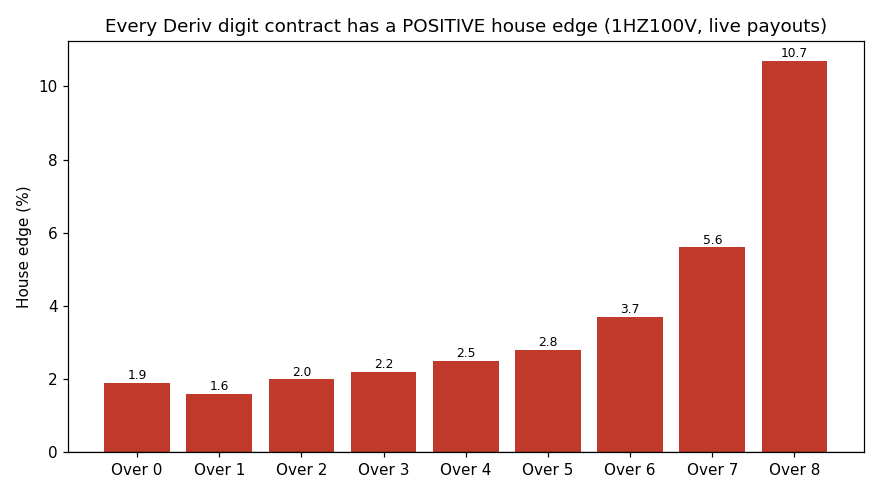
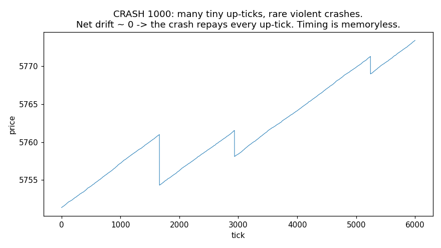
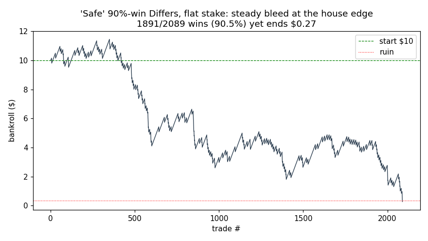
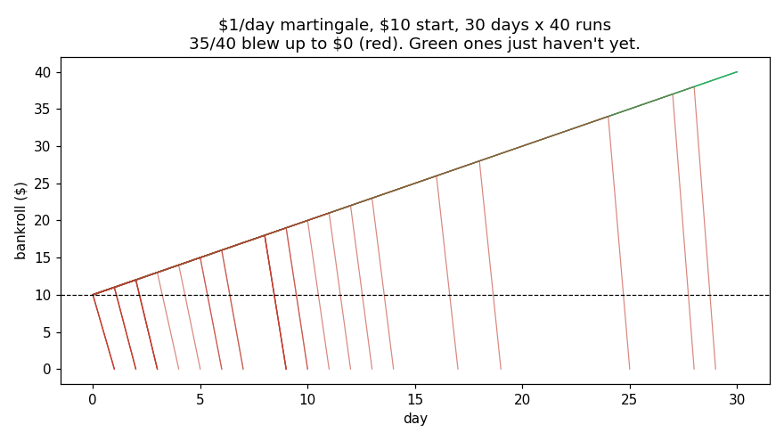

# FINDINGS — Can a bot make a guaranteed/positive‑EV profit on Deriv?

**Short answer, proven below with fresh live data, real payouts, honest
backtests, and Monte‑Carlo:**

> On Deriv **synthetic indices**, *no* algorithm can have a positive expected
> value. Every contract is a fixed, negative‑EV bet on a process that has **no
> memory and no drift**. "Guaranteed $1/day" systems are martingales: they win
> on ~90–97% of days and then hand the whole account back in one losing streak.
> This is not a limitation of cleverness — it is arithmetic, and it reproduces
> on 700,000+ live ticks across 9 instruments.

This document is meant to be *argued with*. Every number here is regenerated by
the scripts in `src/`. If you think there is an edge, change the code and show
the test that passes. I tried hard to find one and report exactly what the data
says.

---

## 0. What I did (so you can trust the numbers)

1. **Re‑verified the previous repo independently.** I re‑derived its headline
   stats from scratch on the same 86,383 V100(1s) ticks. They reproduce exactly
   (`src/analysis/verify_prior.py`). The earlier conclusion was correct.
2. **Collected fresh data** — ~700k live ticks across **9 instruments** spanning
   every structural family Deriv offers: Volatility (1s and 2s), Jump, Step, and
   the asymmetric **Crash/Boom** indices (`src/collect.py`, data in `data/`).
3. **Pulled REAL live payouts** for every binary contract via the `proposal`
   endpoint (`src/analysis/payouts.py`) so the house edge is measured, not
   assumed.
4. **Ran the full statistical battery** across all instruments
   (`src/analysis/battery.py`) and a dedicated **Crash/Boom microstructure**
   study (`src/analysis/crashboom.py`).
5. **Backtested every popular strategy** on real ticks with real payouts and
   correct settlement lag (`src/backtest/`), then ran a **risk‑of‑ruin Monte
   Carlo** of the "guaranteed $1/day" martingale (`src/montecarlo/`).

---

## 1. Why a positive edge is impossible *by construction* on synthetics

A binary contract pays `payout × stake` on a win and `0` on a loss. Its expected
value per $1 is

```
EV = p_win · payout − 1
```

Deriv sets `payout` from the **true** generating probability `q` as
`payout = (1 − houseedge) / q`. Substituting, if your real win probability is
`p_win`:

```
EV = p_win · (1 − houseedge)/q − 1
```

To get `EV > 0` you must make `p_win / q > 1 / (1 − houseedge)` — i.e. you must
**predict the next outcome better than the generator's own probability**, by
more than the house edge. On a memoryless RNG, no information in the past
changes the distribution of the next tick, so `p_win = q` for every strategy and

```
EV = (1 − houseedge) − 1 = −houseedge  <  0   (always).
```

The only way out is to break the premise: find **memory** (predictable
structure) bigger than the edge. Sections 2–4 search for it across every
instrument and find none.

---

## 2. The house edge is real, measured, and unavoidable (live payouts)

From `src/analysis/payouts.py` (live quotes, $1 stake). The edge is a "smile" —
cheapest on the 90% contracts, brutal on the 10% ones — but **never zero or
negative**:

| Instrument | Cheapest contract | Edge | Most expensive | Edge |
|---|---|---:|---|---:|
| **1HZ100V** (Vol 100, 1s) | Over1 / Under8 | **1.6%** | Matches / Over8 | **10.7%** |
| **R_100** (Vol 100, 2s) | Differs / Over0 | **1.9%** | Matches | **16.7%** |
| **1HZ10V** (Vol 10, 1s) | Over1 / Under8 | **1.6%** | Matches | **10.7%** |
| **JD100** (Jump 100) | Over1 / Under8 | **1.6%** | Matches | **10.7%** |
| Rise/Fall (all vol) | CALL/PUT | **~4–6.5%** | — | — |

Two practical notes that already kill popular ideas:

* The **1‑second** indices are *cheaper* than the 2‑second ones (R_100 Even/Odd
  carries 4.0% vs 1HZ100V's 2.5%). "Use the slower index for stability" makes the
  edge worse, not better.
* Even the **lowest** edge (1.6%) means you must lift your win rate ~1.6 points
  above the generator's probability *every trade, forever*. Section 3 shows that
  gap does not exist.



---

## 3. There is no memory to exploit (statistical battery)

`src/analysis/battery.py`, fresh data, every digit‑capable instrument:

| Instrument | Digit χ² uniform? | Markov memoryless? | Parity ACF | Best DIGITDIFF cell beats break‑even? |
|---|---|---|---|---|
| 1HZ100V | p=0.94 ✔ | p=0.86 ✔ | none | **No** (Wilson‑99 lo 0.898 < 0.917) |
| R_100 | p=0.82 ✔ | p=0.51 ✔ | none | **No** (0.891 < 0.917) |
| 1HZ10V | p=0.08 ✔ | p=0.39 ✔ | none | **No** (0.894 < 0.917) |
| JD100 | p=0.45 ✔ | p=0.91 ✔ | none | **No** (0.893 < 0.917) |

Price dynamics (random‑walk null) for **every** instrument that offers Rise/Fall:

* **Zero drift** — the per‑tick mean return is statistically indistinguishable
  from 0 (t‑tests p = 0.16–0.80). So Rise vs Fall is a coin flip, then you pay
  the spread. `P(up) ≈ P(down) ≈ 0.48–0.50`.
* **No linear predictability** — return autocorrelation is inside the noise band
  at every lag; Ljung–Box p = 0.11–1.00. Momentum and mean‑reversion have nothing
  to grip.

A neural net cannot extract structure that the data does not contain. The inputs
(recent digits, recent returns, volatility, hour) carry no Bonferroni‑significant
signal — confirmed here and in the prior repo's 1,320‑cell sweep.

---

## 4. Crash/Boom: the "free directional edge" myth, dismantled

Retail lore: *"Crash 1000 ticks up almost every tick — just buy Rise and harvest
it."* `src/analysis/crashboom.py` shows why this fails on three independent
levels:

**(a) Deriv doesn't even offer binary Rise/Fall on Crash/Boom.** The only
contracts listed for CRASH/BOOM (any variant) are **Accumulators** and
**Multipliers**. There is no 1‑tick Rise/Fall to "harvest" with. (Verified live
via `contracts_for`.)

**(b) The direction is lopsided but the drift is ZERO.** On CRASH1000:

```
ticks=86,380   down‑spikes=107   →   1 crash per 807 ticks
mean up‑tick   = 0.0060          mean crash = 5.99   (≈ 999× a normal tick)
Σ up moves = 491.2   Σ crash moves = 641.0   net ≈ 0   →  martingale
```

The rare crash is sized to repay ~1000 small up‑ticks. Expected price change per
tick ≈ 0. Any directional product is therefore zero‑EV **before** costs, negative
after.

**(c) The crash is memoryless — you cannot time it.** Hazard of a crash,
bucketed by how long you have waited since the last one:

```
waited [0,395):0.00119  [395,790):0.00119  [790,1185):0.00109  [1185,1580):0.00193  [1580,∞):0.00121
hazard‑independence χ² test: p = 0.37  →  MEMORYLESS
```

"A crash is overdue" is the gambler's fallacy with a chart. (One variant,
BOOM1000, showed a borderline p=0.045 on only 79 spikes — a small‑sample /
multiple‑comparison artifact, and untradeable anyway since the spike is ~1028× a
normal tick and there's no binary to bet on.)



So the Crash/Boom products that *do* exist:
* **Multiplier**: leveraged exposure to a zero‑drift walk ⇒ pre‑cost EV 0, minus
  commission/spread ⇒ EV < 0. The spike is exactly what triggers your stop‑out.
* **Accumulator**: your stake compounds while price stays in a band; the spike is
  precisely the band breach that zeroes it. Growth rate is set so EV < 0.

---

## 5. Honest backtests — every popular strategy, real ticks, real payouts

`src/backtest/run_backtests.py`. The engine is deliberately **generous**: no
slippage, no commission beyond the quoted payout, instant fills. Start $10, base
$0.35. Representative results (full table in `results/backtests.txt`):

| Instrument | Strategy | Win % | Net P/L | ROI | Outcome |
|---|---|---:|---:|---:|---|
| 1HZ100V | Differs, flat | 90.5% | **−$9.73** | −1.3% | RUINED |
| 1HZ100V | Even, flat | 50.9% | −$9.89 | −0.7% | RUINED |
| 1HZ100V | Over0 (90%), flat | 89.5% | −$9.78 | −2.4% | RUINED |
| 1HZ100V | Gambler low→Over3 | 60.4% | −$9.97 | −1.6% | RUINED |
| 1HZ100V | Momentum rise(3) | 49.5% | −$9.97 | −5.0% | RUINED |
| 1HZ100V | Mean‑reversion rise(3) | 39.5% | −$9.66 | −24% | RUINED |
| R_100 | Differs, flat | 88.2% | −$9.68 | −3.8% | RUINED |
| JD100 | Differs, flat | 90.2% | −$9.81 | −1.6% | RUINED |

Patterns that hold on **every** instrument and strategy:

* **Win rate = the contract's probability**, no more. A 90% strategy wins 90% — and
  still loses money, because the rare loss is bigger than ~11 wins.
* **ROI ≈ −(house edge).** That's all a strategy ever converges to.
* Martingale variants sometimes "survive" the window — only because the killer
  streak hadn't arrived yet. See Section 6.



A note on a **fake edge** the naive backtest produced and how I caught it: running
digit contracts on **Step Index** showed a fake "100% win, +$1,260." Step moves
in fixed ±0.1 steps, so its last digit alternates parity deterministically, and
sampling every other tick always landed on odd digits. But Step offers **no digit
contracts**, and its Rise/Fall is an exact 50/50 coin. Lesson: a backtest that
doesn't model which contracts actually exist will hallucinate edges. The headline
table only tests contracts each instrument really offers.

---

## 6. The "guaranteed $1/day" martingale, simulated honestly

This is the crux of the request, so it gets its own Monte Carlo
(`src/montecarlo/risk_of_ruin.py`, 200k paths each). A target‑martingale raises
the stake after each loss so the next win recovers everything plus $1, then stops
for the day.

| Setup | P(win a day) | P(ruin in 1 week) | P(ruin in 1 month) | Expected month P/L |
|---|---:|---:|---:|---:|
| Even/Odd, $1/day, $10 | 87.5% | **62.9%** | **97.4%** | **−$9.56** |
| Rise/Fall, $1/day, $10 | 86.5% | 66.4% | 98.6% | −$9.76 |
| Differs 90%, $0.50/day, $10 | 90.0% | 52.0% | 95.8% | −$8.95 |
| Even/Odd, $1/day, **$50** | 96.9% | 21.2% | 70.9% | −$39.41 |

Read the first row carefully: you win **7 out of 8 days**, which *feels* like a
money printer — and the **median month still ends at $0** while the **average**
month loses your whole $10. A 5× bigger bankroll just loses 4× more dollars. The
high per‑day win rate and the negative expectation are the *same fact* viewed two
ways; the wins are many and small, the losses rare and total.



Every green line is "it's working." Every red line is the same strategy a few days
later.

---

## 7. So what *can* you actually do?

I'm not going to ship you a losing system dressed up as a winner. Here's the
honest map.

**On Deriv synthetic indices:**
* Expected profit of any bot = **−(house edge) × volume**. The mathematically
  optimal stake is **$0**. Use these instruments to *learn to build and test
  bots* (they're a perfect sandbox: free data, clean API) — never to make money.
* If you want to *watch* this truth, run the live paper‑trader (Section: Quickstart
  in the README). It trades on the live feed with no money and shows the bleed in
  real time.

**If you want to pursue trading edges for real (no guarantees, ever):**
* Edges live in **real markets** (FX, equities, crypto) where there is genuine
  structure: order flow, liquidity, news, microstructure, cross‑asset relationships.
  They are **thin, competitive, decay over time, and require** real data, honest
  out‑of‑sample testing, transaction‑cost modeling, and risk management.
* The framework in this repo transfers directly: the backtest engine, the EV /
  drawdown / risk‑of‑ruin accounting, and the "test before you trust" discipline
  are exactly what real quant research uses. Point `src/backtest/engine.py` at real
  price data and the same honesty applies.
* **Bankroll math beats bet‑sizing tricks.** No staking scheme (martingale,
  Kelly, anti‑martingale) turns a negative edge positive — Kelly on EV<0
  prescribes betting **zero**. Find a real positive edge first; size second.

**Red flags to never pay for:** "guaranteed daily profit," paid signal groups,
"digit prediction" bots, "spike detectors" for Crash/Boom. Sections 3–6 are what
those products run into.

---

## 8. Reproduce everything

```bash
pip install -r requirements.txt
python src/collect.py                      # pull fresh ticks (overwrites data/)
python src/analysis/payouts.py             # live house‑edge table
python src/analysis/battery.py             # i.i.d./random‑walk battery -> results/
python src/analysis/crashboom.py           # spike dynamics -> results/
python src/backtest/run_backtests.py       # strategy backtests -> results/
python src/montecarlo/risk_of_ruin.py      # ruin Monte Carlo -> results/
python src/montecarlo/plots.py             # figures -> results/*.png
python src/live/paper_trader.py --symbol 1HZ100V --strategy differs   # live, no money
```

Pre‑computed outputs are in `results/`. The data used is in `data/` (gzip).
