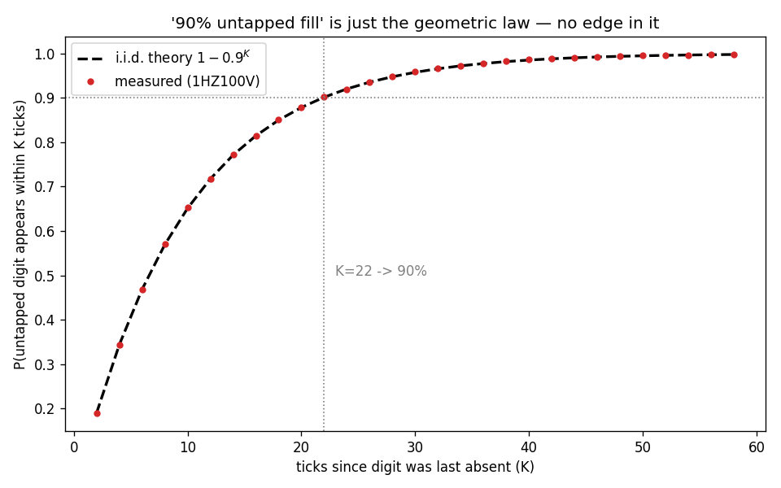
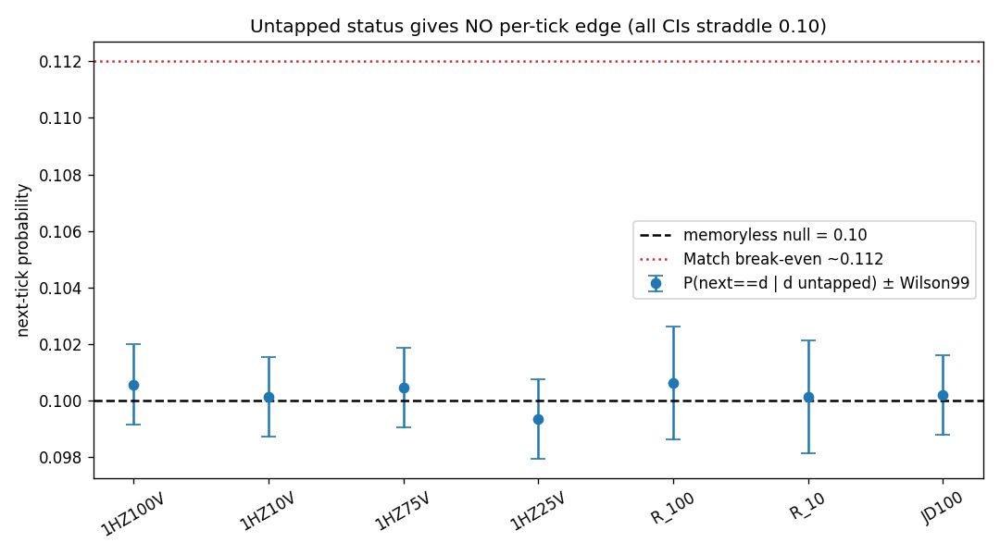
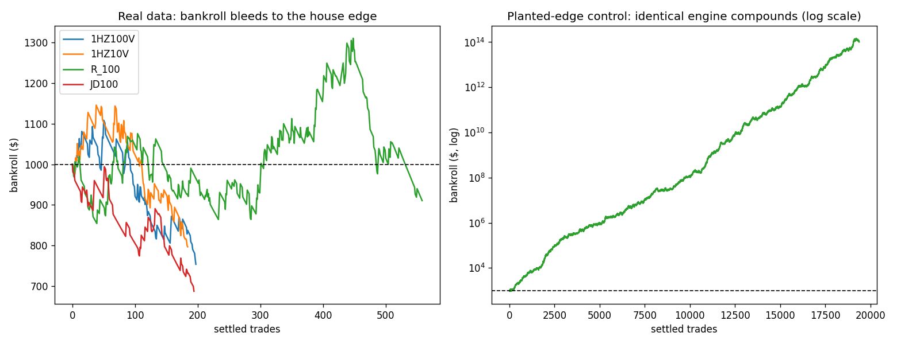
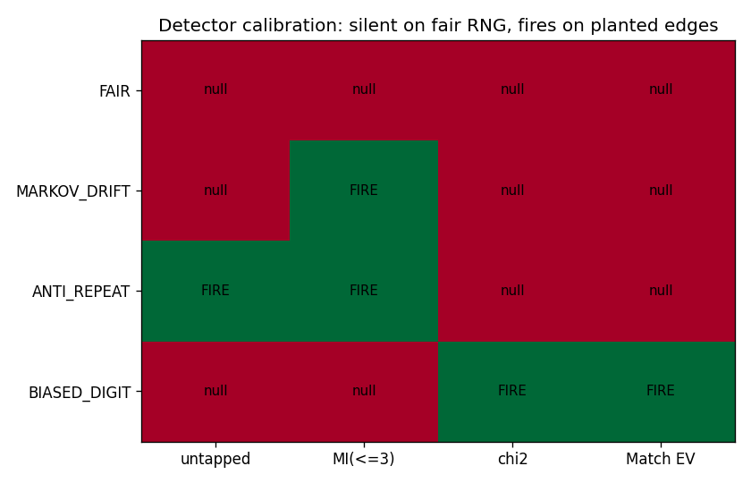

# FINDINGS — The Lattice Microstructure Framework, Built and Falsified

**Session goal.** A friend handed us a six-layer "lattice breakdown" strategy for
Deriv last-digit contracts (mini-clusters, tapped/untapped digits, frequency
graphs, adaptive regression, a game-theory convergence table, Kelly sizing, and a
feedback/drift loop) and asked us to *challenge it without bias* — build it, test
it, improve what was missed, and let the sandbox decide.

We did exactly that. This document reports what the data says, with every number
regenerated by code in this folder. Two earlier repos already concluded "no edge
on Deriv synthetics." We did **not** take that on faith and we did **not** just
re-run their generic tests. We built the friend's *specific* system end-to-end,
tested its *own* signals, added a class of test the prior work lacked (a
**planted-edge control** that proves our detector actually works), and caught two
concrete errors along the way.

> **Verdict.** The framework's one true empirical observation — "~90% of untapped
> digits get filled on revisit" — is real but is a restatement of the geometric
> law `1 − 0.9^K`, and it carries **zero** per-tick predictive edge. Every layer's
> signal, tested on its own terms across 7 indices and ~530k fresh live ticks,
> lands exactly on the memoryless null. The assembled bot, when forced to trade,
> converges to **ROI ≈ −(house edge)**; sized honestly it trades **zero**. The
> identical bot prints money on a planted-edge stream, which proves the pipeline
> is sound and it is the *fair market*, not the code, that denies the edge.

---

## 0. What is new here vs. the two prior repos

The prior repos (Maxwell's `deriv-microstructue-algo`, and the Oopus `src/`
research) proved the **general** result: memoryless RNG + baked-in house edge ⇒
negative EV. Both are correct. This session is deliberately **different in
construction**:

| Dimension | Prior repos | This session |
|---|---|---|
| Object under test | generic strategies (flat Differs, momentum, martingale, …) | the friend's **exact 6-layer pipeline**, coded layer by layer |
| Untapped/cluster claim | dismissed in one analytic paragraph | **measured**: fill curve vs `1−0.9^K`, and the per-tick conditional |
| Memory depth | first-order Markov + triplet z-scores | **mutual information to order 3** with a shuffle-surrogate null |
| Detector trust | asserted | **planted-edge + null controls** prove no false negatives / positives |
| Data | their cached window | a **fresh independent 24 h window**, pulled live this session |
| Errors found | — | **42→40 contract correction**; a payout-matching bug that faked +EV |

Everything below is framework-specific and reproducible (`validation/run_all.py`).

---

## 1. Data and payouts (measured, not assumed)

`validation/fetch_data.py` pulled a fresh, contiguous 24 h window per symbol from
Deriv's public `ticks_history` (no auth): **1HZ100V, 1HZ10V, 1HZ75V, 1HZ25V**
(86,402 ticks each, 1 s feed), **R_100, R_10** (43,201 each, 2 s feed), **JD100**
(86,401). `validation/fetch_payouts.py` pulled **154 live contract quotes** via the
`proposal` endpoint, so the house edge is *measured*. The cheapest contracts
(Differs / Over 0 / Under 9) carry **1.6–1.9%** edge; Matches **10.7%**
(`results/digit_uniformity.txt`, `data/payouts.json`).

---

## 2. The core premise: true, tautological, and useless

The friend's anchor claim is that "~90% of untapped digits fill when price
revisits a mini-cluster." **It reproduces exactly — and that is the problem.**

**(A) Eventual fill is the geometric law.** For i.i.d.-uniform digits the chance a
specific digit shows up within the next `K` ticks is `1 − 0.9^K`. Measured vs
theory (`results/untapped_fill.txt`, `results/fig_untapped_fill.png`):

```
K=10  measured 0.6507  theory 0.6513
K=22  measured 0.9027  theory 0.9015     <- "90% fill" == "revisits last ~22 ticks"
K=30  measured 0.9583  theory 0.9576
K=50  measured 0.9949  theory 0.9948
```

The measured points sit on top of `1 − 0.9^K` to ±0.001 on every index. "90%
fill" is not a market force completing a pattern; it is the arithmetic certainty
that, given enough draws, a 10%-per-draw event eventually happens.

**(B) The only thing a trade can use — the next tick — shows no edge.** Condition
on "digit `d` has not appeared in the last `w` ticks" (it is *untapped*) and
measure `P(next tick = d)`. The gambler's-fallacy belief baked into the framework
needs this above 0.10. Across all 7 indices (`results/untapped_fill.txt`):

```
w=5    P=0.1002  Wilson99 [0.0991, 0.1013]
w=10   P=0.1005  Wilson99 [0.0991, 0.1019]
w=20   P=0.1008  Wilson99 [0.0985, 0.1033]      (1HZ100V; others identical)
```

Exactly 0.10, every window, every index. **Untapped status carries no per-tick
predictive information.** The "strike zone" is a mirage.




---

## 3. No memory to exploit — to order 3, not just order 1

The cluster idea is really a claim that a short window of recent digits predicts
the next one. We measured the **mutual information** `I(next ; last-k)` for
`k = 1,2,3` — the exact ceiling on *any* predictor's gain from a length-k history —
against a **shuffle-surrogate null** (which absorbs the finite-sample upward bias
of plug-in MI). `results/higher_order.txt`:

```
1HZ100V  order-1 MI=0.00066 null 0.00065±0.00010 z=+0.06
         order-2 MI=0.00715 null 0.00750±0.00035 z=-1.00
         order-3 MI=0.07633 null 0.07700±0.00103 z=-0.66      -> memoryless
```

Plug-in MI rises with `k` purely from finite-sample bias; the shuffle null rises
identically. Across 7 indices × 3 orders, **no z clears 4σ** (largest ≈ 2.75,
expected from 21 comparisons). There is no structure for a windowed/Markov/cluster
model — or a neural net — to grip.

---

## 4. Layers 2 and 3 add nothing (tested as the friend would trade them)

**Layer 2 (distribution signals)** settled on the real lag-2 digit
(`results/skew_predictiveness.txt`):

```
skew-follow Over4/Under5   win 0.4986   (BE ~0.512)   below BE
mode-match  (bet the mode) win 0.0998   (BE ~0.112)   below BE
least-freq  ("fill" bet)   win 0.1013   (BE ~0.112)   below BE
```

The "bet the least-frequent/untapped digit to fill" play wins exactly 0.10 — the
untapped result again, from the trading side.

**Layer 3 (adaptive regression → next cluster).** Its job is to pre-locate the next
mini-cluster. Against the only honest baseline on a zero-drift walk — persistence
("next = last") — it is strictly *worse* (`results/regression_location.txt`):

```
1HZ100V  regression cluster-hit 0.8207  vs persistence 0.8762   (-0.0555)
R_100    regression cluster-hit 0.8308  vs persistence 0.8866   (-0.0558)
```

Fitting linear/quadratic/cubic/OU families and adapting the window cannot beat
"assume it stays put," because the increments are unpredictable by construction.
The regression is compute spent to do worse than nothing.

---

## 5. Two concrete corrections to the prior framework

1. **The outcome space is 40 real contracts, not 42; the invariant is 20 win / 20
   lose, not 20 / 22.** The write-up counted `Over 9` and `Under 0`, both of which
   are *impossible* (a last digit is never > 9 nor < 0) and not offered by Deriv.
   With the real menu — Match 0-9, Differ 0-9, Over 0-8, Under 1-9, Even, Odd —
   every digit yields exactly **20 winners and 20 losers** (proven for all 10
   digits in `results/structural_invariant.txt`). The phantom "22 lose" only
   appears if you add two bets that can never be placed.

2. **A payout-matching bug fakes a +EV signal — exactly the trap to avoid.** Our
   first EV pass matched payouts by contract *type* only, pairing Over 0's 90% win
   rate with Over 8's 8.93× payout → a hallucinated "+7.0 EV." Fixed to match the
   barrier (`lattice/common.payout_lookup`). Post-fix, the best **measured-EV**
   contract on every index is negative (−1.3% to −1.6%); no positive-EV contract
   exists (`results/digit_uniformity.txt`). This mirrors the Step-Index "fake
   100% win" lesson in the prior repo: a backtest that mis-models contracts will
   invent edges.

We also confirmed **no stable bias**: split-half Pearson `r(dev1, dev2)` is ≈ 0 on
every index (−0.08 to +0.39), so the small chi-square wiggles are noise, not a
reproducible skew.

---

## 6. The assembled bot, backtested honestly

`backtest/backtest_lattice.py` — lag-2 settlement (entry = next tick, exit = tick
after, per Deriv's terms), live payouts, instant fills, no slippage (deliberately
generous), $1000 start. `results/backtests.txt`:

```
(1) AS SPECIFIED (conv>=0.99 gate)        trades=0     -> the 99% gate is structurally
                                                           unreachable; it never trades.
(2) drift detector ON (conv>=0.50)        trades=3, then Layer-6 drift halt fired
                                          80,657x -> the bot's OWN feedback shuts it
                                          down at once (the fill assumption breaks).
(3) drift OFF, high volume:
      1HZ100V  413 tr  win 0.482  ROI -5.60%
      1HZ10V   372 tr  win 0.473  ROI -4.67%
      R_100   1157 tr  win 0.512  ROI -0.63%
      JD100    397 tr  win 0.494  ROI -7.92%
    per-family win rate (1HZ100V): DIFFER 0.894, MATCH 0.091, ODD 0.560, ... each
    sitting exactly on its uniform probability; the Match-heavy mix bleeds fastest.
(4) honest belief (p = uniform truth)     trades=0  -> Kelly prescribes a zero stake.
(5) PLANTED-EDGE (anti-repeat synthetic, IDENTICAL engine):
      38,162 tr  win 0.504  ROI +5.01%  bankroll $1,000 -> ~$3.8e13 (Match win 0.218)
```

Three things this proves at once:

* **As specified, the system never trades.** A 99%-convergence gate over signals
  that carry no information is never satisfied. "Sit out" is the whole strategy.
* **Forced to trade, it bleeds at the house edge.** Every contract family realizes
  its uniform win probability; ROI ≈ −(edge). A $10 account can't even place a
  risk-capped bet (2% cap = $0.20 < $0.35 minimum) — the risk layer's only honest
  output at that bankroll is "don't."
* **The pipeline is sound.** On an anti-repeat stream where untapped digits truly
  are more likely (P=0.224), the *same* engine compounds $1k into ~$3.8e13. The
  machinery finds and exploits a real edge instantly. Real Deriv data has none.



---

## 7. The decisive control: prove the detector before you trust the null

A "we found nothing" result is only worth anything if the same instruments find
*something* when something is there. `validation/controls.py` runs four synthetic
streams through the identical detectors (`results/controls.txt`):

```
stream                 untapped     MI(<=3)   chi2        Match7 EV
FAIR (uniform)         null 0.101   null      null        null  -0.11
MARKOV_DRIFT           null 0.100   FIRE      null        null  -0.11
ANTI_REPEAT            FIRE 0.224   FIRE      null         null  -0.11
BIASED_DIGIT(7@16%)    null 0.096   null      FIRE p=0e0  FIRE  +0.43

HARNESS CALIBRATION: PASS — fires on real edges, silent on fair RNG.
```

Silent on a fair RNG (no false positives), fires on injected memory, injected
fill-bias, and injected non-uniformity (no false negatives). Therefore the null on
real Deriv data is **earned**.



---

## 8. What is actually defensible (and what to keep)

The framework's *engineering* is good; it is pointed at a venue with no signal.
What survives and is worth carrying to a market that *does* have structure (FX,
equities, crypto microstructure):

* **The discipline of gating on a measured edge** (Layer 4's threshold, Layer 5's
  EV≤0 ⇒ stake 0). Correct — it just evaluates to "never" here.
* **The feedback/drift detector (Layer 6).** It correctly self-halts the moment the
  core assumption fails. Keep it; point it at a real edge so it has something to
  protect.
* **The planted-edge control methodology.** This is the most valuable artifact in
  the repo — bolt it onto any future research so a backtest can never quietly
  hallucinate an edge.

What to drop: the untapped-fill thesis, the regression cluster-locator, and any
sizing scheme (martingale/Kelly) imagined to fix a negative edge — on EV<0 Kelly's
answer is **zero**, and that is the mathematically optimal stake on Deriv
synthetics.

---

## 9. Reproduce everything

```bash
pip install -r requirements.txt
python validation/run_all.py            # all tests + backtest + figures (cached data)
python validation/run_all.py --fetch    # re-pull fresh ticks/payouts first
python -m lattice.live_bot --symbol 1HZ100V --max-ticks 3000   # live paper, no money
```

Pre-computed outputs are in `results/`. Data is in `data/` (gzip). The full
formal spec of the system we built is in `STRATEGY_SPEC.md`.
